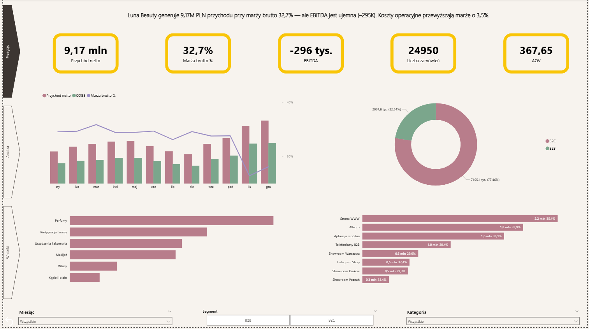
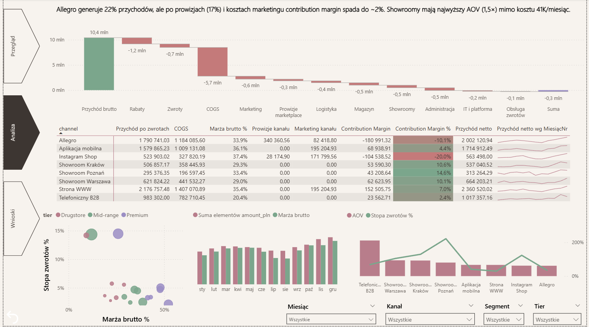
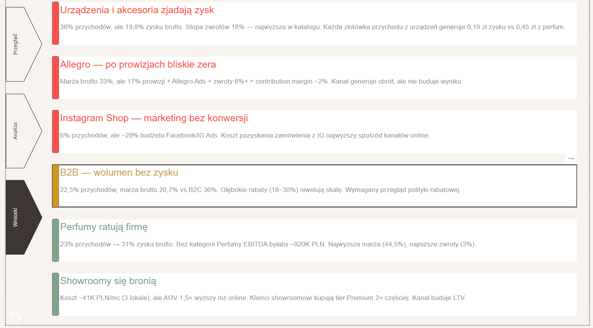

# Luna Beauty – Channel & Category Profitability Analysis

**Analiza rentowności kanałów sprzedaży i kategorii produktowych polskiego e-commerce drogeryjno-perfumeryjnego.**

Projekt portfolio. Dane są w pełni syntetyczne — nazwy firm, marek i klientów są fikcyjne.



---

## Kluczowe wyniki

| KPI | Wartość |
|-----|---------|
| Przychód netto | 9,17M PLN |
| Marża brutto | 32,7% |
| EBITDA | –296K PLN (–3,5%) |
| Zamówień | 24 950 |
| Kanałów sprzedaży | 8 (online + offline + B2B) |
| Kategorii produktowych | 6 (225 SKU) |

### Trzy wnioski

1. **Urządzenia i akcesoria generują 36% przychodów, ale tylko 19,8% zysku brutto.** Stopa zwrotów 18% — najwyższa w katalogu. Każda złotówka przychodu z urządzeń daje 0,19 zł zysku vs 0,45 zł z perfum.

2. **Allegro po prowizjach (17%) i kosztach marketingu ma contribution margin –10,1%.** Kanał generuje obrót, ale nie buduje wyniku. Instagram Shop jest jeszcze gorszy: –20% CM przy 6% udziale w przychodach.

3. **Showroomy się bronią.** Koszt ~41K PLN/mc, ale AOV 1,5× wyższy niż online, klienci kupują tier Premium 2× częściej. Contribution margin 10–14%.

---

## Kontekst biznesowy

Luna Beauty to fikcyjny polski e-commerce drogeryjno-perfumeryjny. Sprzedaż odbywa się w trzech modelach: detalicznie online (strona WWW, aplikacja mobilna, Allegro, Instagram Shop), w trzech showroomach stacjonarnych (Warszawa, Kraków, Poznań) oraz hurtowo B2B do salonów kosmetycznych, SPA i małych drogerii.

Zarząd pyta: **czy nasz biznes jest naprawdę zdrowy?** Wyniki roczne pokazują obrót na poziomie 9 mln PLN i marżę brutto ponad 30%, ale EBITDA wychodzi lekko ujemna. Dashboard odpowiada na pytanie, **które kanały, segmenty i kategorie realnie budują (lub niszczą) wynik firmy**.

---

## Dashboard — 3 strony

### Strona 1 — Przegląd

KPI cards, trend przychodu vs COGS z linią marży, podział B2C/B2B, ranking kategorii i kanałów.


### Strona 2 — Analiza kanałów i kategorii

Waterfall (od przychodu brutto do EBITDA), tabela contribution margin per kanał z conditional formatting, scatter plot marża vs zwroty, struktura OpEx.



### Strona 3 — Wnioski

6 kart traffic-light z konkretną liczbą, oceną (czerwony/żółty/zielony) i rekomendacją.



---

## Metodologia

### Model danych (Star Schema)

```
  [DimDate]          [DimProduct]        [DimCustomer]
      │                   │                    │
      ▼                   ▼                    ▼
 [FactOrders] ◄── product_id ──► [DimProduct]
      │                                        
      ├── channel ────► [DimChannel]  (prowizje per kanał)
      │
 [FactReturns] ── order_id ──► [FactOrders]
      │
 [FactOpEx]    ── month ──────► [DimDate]
```

### Alokacja kosztów wspólnych

Kluczowe wyzwanie projektu: OpEx w źródle jest na poziomie miesięcznym, ale porównanie rentowności kanałów wymaga alokacji kosztów wspólnych. Zastosowane podejście:

- **Koszty bezpośrednie** (marketing per kanał, prowizje marketplace) — przypisane wprost do kanału
- **Prowizje** — obliczane dynamicznie z tabeli DimChannel (fee_pct × przychód)
- **Koszty wspólne** (magazyn, administracja, IT, logistyka) — alokowane pro-rata do udziału kanału w przychodach

### Kluczowe miary DAX

- `Contribution Margin` — marża brutto minus prowizje, marketing kanału, obsługa zwrotów i alokowany OpEx wspólny
- `Waterfall Wartość` — miara SWITCH z tabelą kroków, dająca waterfall od przychodu brutto do EBITDA
- `Przychód netto MoM %` — time intelligence z DATEADD dla sparklines

---

## Stack technologiczny

| Narzędzie | Zastosowanie |
|-----------|-------------|
| Power BI Desktop | Dashboard, model danych, wizualizacje |
| DAX | Miary rentowności, time intelligence, alokacja kosztów, waterfall |
| Power Query (M) | Import i transformacja danych z xlsx |
| Star Schema | Architektura modelu (3 fakty, 4 wymiary) |
| Python | Generowanie datasetu syntetycznego (pandas, numpy) |

---

## Wnioski analityczne — szczegóły

| # | Wniosek | Sygnał | Metryka |
|---|---------|--------|---------|
| 1 | Urządzenia i akcesoria zjadają zysk | 🔴 | 36% przychodów → 19,8% zysku, 18% zwrotów |
| 2 | Allegro — po prowizjach bliskie zera | 🔴 | CM –10,1%, prowizje 17% + marketing + zwroty |
| 3 | Instagram Shop — marketing bez konwersji | 🔴 | 6% przychodów, ~29% budżetu FB/IG Ads, CM –20% |
| 4 | B2B — wolumen bez zysku | 🟡 | Marża brutto 20,7% vs B2C 36%, rabaty 18–30% |
| 5 | Perfumy ratują firmę | 🟢 | 23% przychodów → 31% zysku brutto, marża 44,5% |
| 6 | Showroomy się bronią | 🟢 | AOV 1,5×, CM 10–14%, tier Premium 2× częściej |

---

## Dane

Dataset jest w pełni syntetyczny, wygenerowany algorytmicznie w Pythonie z celowo wbudowanymi wzorcami biznesowymi (sezonowość, struktura marż, różnice B2B/B2C, koszty kanałów). Szczegóły w arkuszu README pliku xlsx oraz w `docs/Luna_Beauty_Case_Brief.pdf`.

| Arkusz | Opis | Wierszy |
|--------|------|---------|
| Orders | Linie zamówień — przychody i koszty zmienne per produkt | ~24 000 |
| Products | Katalog SKU — kategoria, marka, tier, cena | 225 |
| Customers | Baza klientów B2C/B2B | 2 620 |
| Returns | Zwroty — data, wartość, koszt obsługi | ~1 500 |
| OpEx | Koszty operacyjne miesięczne w 7 kategoriach | ~230 |

---

## Kontakt

**Michał Kowalczyk** · [LinkedIn](https://www.linkedin.com/in/michaljkowalczyk) · kowalczykmj95@gmail.com
